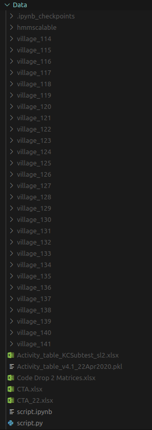

# RoboTutor-Analysis

## Installation and Setup

1. This repo works with <a href="https://github.com/jithendaraa/hotDINA">hotDINA</a> to fit model parameters which has scripts to automatically extract RoboTutor-Analysis/Data (which has to be setup). After fitting, this repo obtains these parameters to update on logged data from usage of RoboTutor. The first step would be to create a project folder: ```mkdir project```
2. Clone this repo and the hotDINA repo inside the project folder. <br>
   ```
   cd project
   git clone https://github.com/jithendaraa/hotDINA
   git clone https://github.com/jithendaraa/RoboTutor-Analysis
   ```
3. Setting up all the required RoboTutor data in `RoboTutor-Analysis/Data`:
    - Check out step 3 in <a href='https://github.com/jithendaraa/hotDINA/blob/master/README.md'>README for hotDINA</a> to set up activity tables, CTA and Code Drop 2 Matrices. 
    - For getting transactions tables per village, see step 2 in the same README. 
    - At the end of the data setup your `Data` directory must look something like this:

    <center></center>

    Don't worry if you do not have the .pkl and CTA_22.xlsx files, the various scripts will still work!


## Instructions and Usage

1. Coming soon!
   
   
## Todo:
- Complete this README.md

### Student Models
 - [x] ItemBKT
 - [x] ActivityBKT
 - [x] hotDINA_skill
 - [x] hotDINA_full

### RL Agents and integrations with student models (primary usage is meant to be with PPO since it is SOTA)
- [ ] Type 1 (**Action**: Finding optimal performance thresholds t1, t2, t3 per student)
    - [ ] ItemBKT
    - [ ] ActivityBKT
    - [x] hotDINA_skill
    - [ ] hotDINA_full
- [ ] Type 2 (**Action**: Finding optimal performance thresholds t1, t2, t3 after each attempt)
    - [ ] ItemBKT
    - [ ] ActivityBKT
    - [x] hotDINA_skill
    - [ ] hotDINA_full
- [ ] Type 3 (**Action**: Decide promotion/demotion; choose one out of prev, same, next, next-next)
    - [ ] ItemBKT
    - [ ] ActivityBKT
    - [x] hotDINA_skill
    - [ ] hotDINA_full
- [ ] Type 4 (**Action**: Same as type 3 but transition constraint is no longer 4 (prev, same, next, next-next))
    - [ ] ItemBKT
    - [ ] ActivityBKT
    - [x] hotDINA_skill
    - [ ] hotDINA_full
- [ ] Type 5 (**Action**: Same as 3 but with removed transition constraint and area rotation constraint "Lit-Num-Lit-Sto")
    - [ ] ItemBKT
    - [ ] ActivityBKT
    - [x] hotDINA_skill
    - [ ] hotDINA_full

For meaning of "types of RL agent", please refer <a href="https://docs.google.com/document/d/1saE4yC0xdfc8t3REdJMxbOeBfwfSbaFcSIyDA8Yhqbc/edit"> this doc </a>